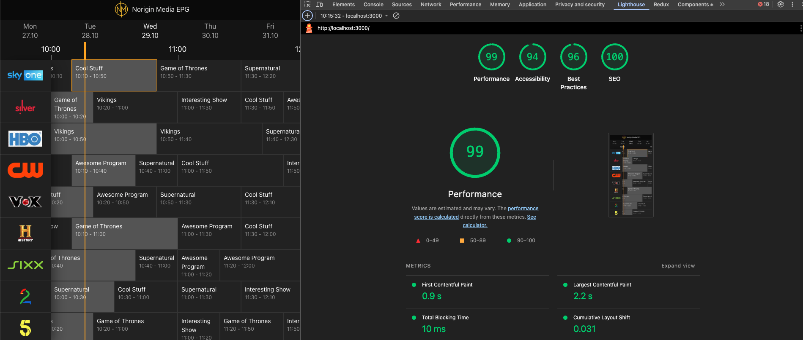
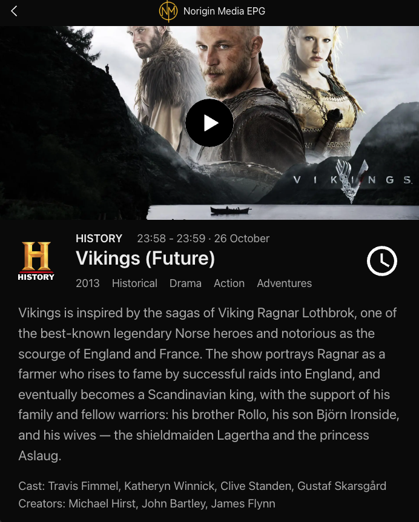
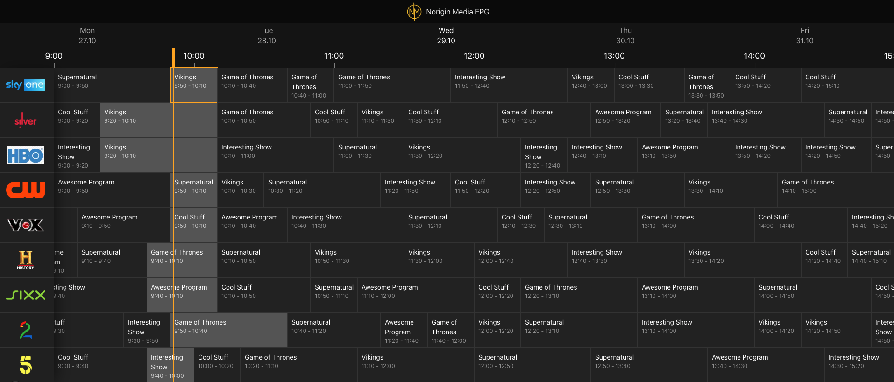

# Norigin Media EPG Candidate Tester

Testing task for new FrontEnd (Web) candidate

## Requirements

- Build a single screen web or native application (EPG Screen) using your choice of framework / tooling

- For Web Developers: React, Vue.js, React-Native, Vanilla JS / Typescript, for example - No restrictions apply, however, try to avoid using project generators / starter-kits / sample projects where possible.

- A base level of interactivity is expected regarding the progression of time and how this is reflected in the EPG. For example the yellow line indicating the current program should update and change, as well as a functional auto-scroll shortcut to be triggered when pressing on the "NOW" button.

- Cool to have (But not required and wont negatively impact assessment):
Add more interactions, animations or just nail the UX.
Responsive layouts for multi-screen support.
Make performance and optimization considerations.
Additional screens using mock data api.
Additional EPG showing an alternative layout.
Use Spatial Navigation to enable remote control navigation through items

## Instalation 🔧

Since the dependencies are listed in the package.json, it is necessary to run the following command to install the project:

```
npm i
```

Before launching the build of the project, we need to launch the mockup service

```
npm start-api
```
The service must be launched in http://localhost:1337/epg
Once we have checked that the service is properly running we can continue to the next step.

Now we are going to launch the build for produciton mode

```
npm run build
```

Once built we will only have to launch the project with

```
npm run start
```

NOTE: Scripts have been modified in order to work in both Windows and Mac environments.
Besides, concurrent versions of dev and build scripts have been created in order to make the development easier.


## Build with 🛠️

Tools used:

* [ReactJS] (https://react.dev/): Javascript library for web and native user interfaces
* [NextJS] (https://nextjs.org/): ReactJS Framework
* [Zustand] (https://zustand.docs.pmnd.rs/): State management library
* [Date-fns] (https://date-fns.org/): Modern JavaScript date utility library
* [React-Virtual] (https://tanstack.com/virtual/latest): Headless UI for Virtualizing Large Element Lists
* [React-Player] (https://www.npmjs.com/package/react-player): A React component for playing a variety of URLs, including file paths, HLS, DASH, YouTube, Vimeo, Wistia and Mux.

## Highlights 📖

### 1.  Missing Resources
To gracefully handle missing resources—such as broken images—we developed an ImageWithFallback component. This component utilizes a dedicated fallback mechanism defined in utils/fallbackImages.ts, which supplies a default image whenever the primary source is unavailable or fails to load.

### 2. Performance and Optimization Considerations
The main EPG view contains approximately 400 schedule items, each of which must track the current time to indicate if its program is live.

Our solution to this performance challenge was two-fold:

1. Centralized State Management: Instead of equipping each element with its own timer, we created a custom hook that reads from a global Zustand store. This provides a single source of truth for the current time.

2. Virtualization: To prevent all 400 components from re-rendering every minute, we implemented virtualization. This technique ensures that only the visible items in the viewport subscribe to the timer and update, leading to a dramatic performance improvement.

The Lighthouse evaluation yielded the following results:



### 3. Additional screens using mock data api

Following the suggestion, a new layout has been added that fetches data from the mock API at http://localhost:1337/program/{id}.



This screen presents the program's details and a trailer for the show, complete with a built-in video player to watch it.


### 4. WCAG

Achieved AA

Evidences:

- EPG View


- Program View


### 5. Navigation

Upon first loading the site, the interface initializes by positioning the orange timer line at the start of the current hour. The navigation automatically selects the program scheduled for this time slot on the first channel (the top row in the sidebar), which is clearly indicated by an orange highlight.



If you navigate away using the arrow keys or by manually scrolling, a 'Now' button appears. Clicking 'Now' will instantly return the view to the current hour and reselect the program scheduled for that time. The view will also revert to the channel row you were previously on.

Of course, if 'Enter' button is pressed, we can navigate to the selected program details.

## Author ✒️

* **Leonardo Gil Rodríguez** - [Leonardo Gil Rodríguez](https://github.com/leonardogilrodriguez) 

---
