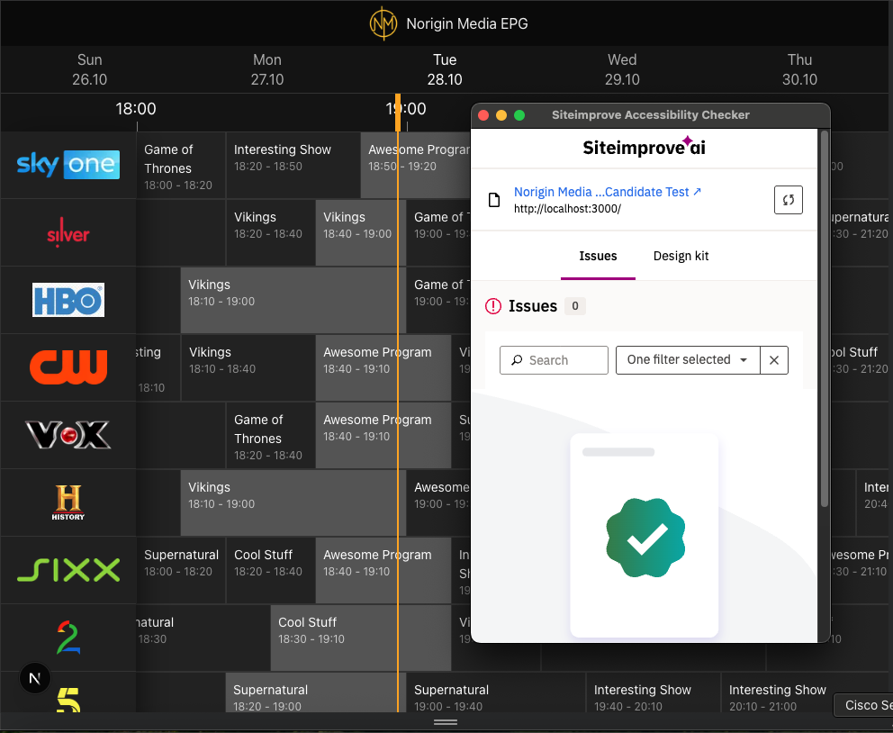
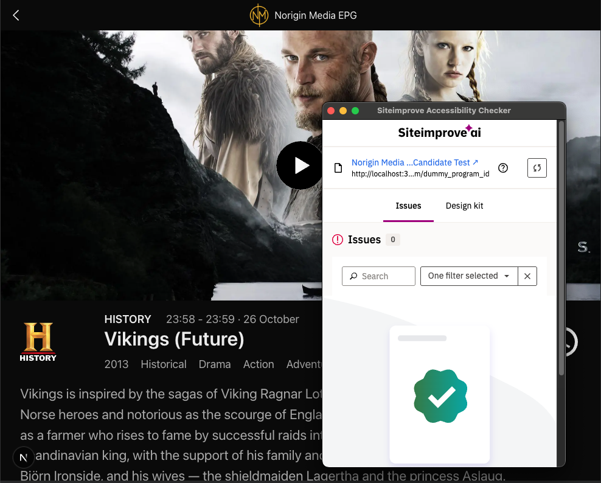

# Norigin Media EPG Candidate Tester

Testing task for new FrontEnd (Web) candidate

## Requirements

- Build a single screen web or native application (EPG Screen) using your choice of framework / tooling

- For Web Developers: React, Vue.js, React-Native, Vanilla JS / Typescript, for example - No restrictions apply, however, try to avoid using project generators / starter-kits / sample projects where possible.

- A base level of interactivity is expected regarding the progression of time and how this is reflected in the EPG. For example the yellow line indicating the current program should update and change, as well as a functional auto-scroll shortcut to be triggered when pressing on the "NOW" button.

- Cool to have (But not required and wont negatively impact assessment):
Add more interactions, animations or just nail the UX.
Responsive layouts for multi-screen support.
Make performance and optimization considerations.
Additional screens using mock data api.
Additional EPG showing an alternative layout.
Use Spatial Navigation to enable remote control navigation through items

## Instalation 🔧

Since the dependencies are listed in the package.json, it is necessary to run the following command to install the project:

```
npm i
```

Before launching the build of the project, we need to launch the mockup service

```
npm start-api
```
The service must be launched in http://localhost:1337/epg
Once we have checked that the service is properly running we can continue to the next step.

Now we are going to launch the build for produciton mode

```
npm run build
```

Once built we will only have to launch the project with

```
npm run start
```

## Build with 🛠️

Tools used:

* [ReactJS] (https://react.dev/): Javascript library for web and native user interfaces
* [NextJS] (https://nextjs.org/): ReactJS Framework
* [Zustand] (https://zustand.docs.pmnd.rs/): State management library
* [Date-fns] (https://date-fns.org/): Modern JavaScript date utility library
* [React-Virtual] (https://tanstack.com/virtual/latest): Headless UI for Virtualizing Large Element Lists
* [React-Player] (https://www.npmjs.com/package/react-player): A React component for playing a variety of URLs, including file paths, HLS, DASH, YouTube, Vimeo, Wistia and Mux.

## Considerations 📖

### 1.  Missing Resources
To manage missing resources, mainly images, the component ImagesWithFallback has been created, and to set a fallback image, it has been created a fallback logic in utils/fallbackImages.ts

### 2. Too many schedules
In the main view (EPG view), there will be around 400 elements (schedules) that need to keep tracking the current hour in order to check if the schedule is currently playing. 
To avoid 400 elements with their own inner clocks, the solution applied has been to create a hook that checks the global store of the site using Zustand.

Besides, there would be still a problem, even thought the hook simplifies the logic, there would still be too many components checking and rendering every minute. To avoid so, the solution apllied has been using virtualization. This way, only components that are in the viewport will check the timer to know is the schedule is currently playing. This improves the performance dramatically.

### 3. WCAG

Achieved AA

Evidences:

- EPG View



- Program View



## Author ✒️

* **Leonardo Gil Rodríguez** - [Leonardo Gil Rodríguez](https://github.com/leonardogilrodriguez) 

---
